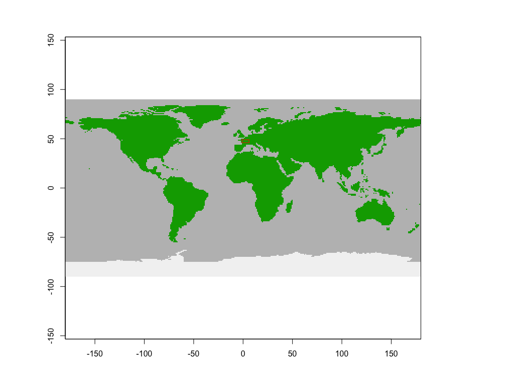
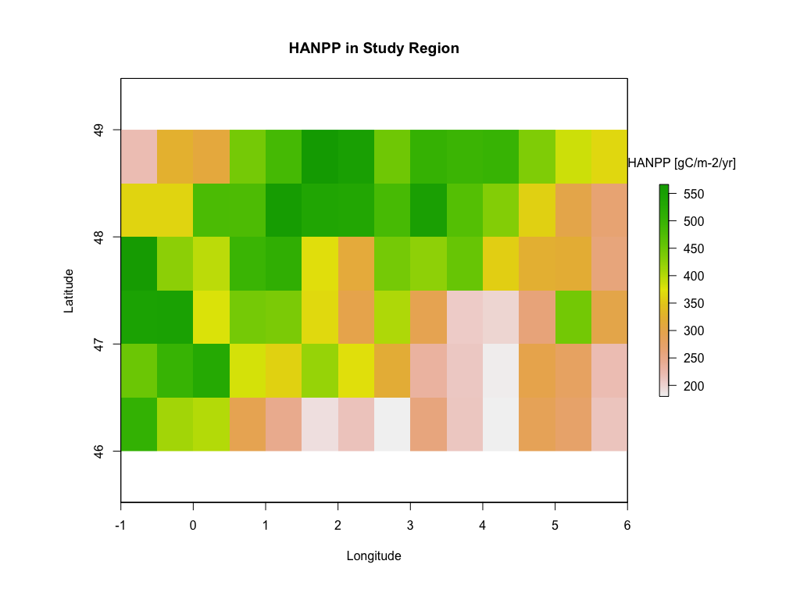
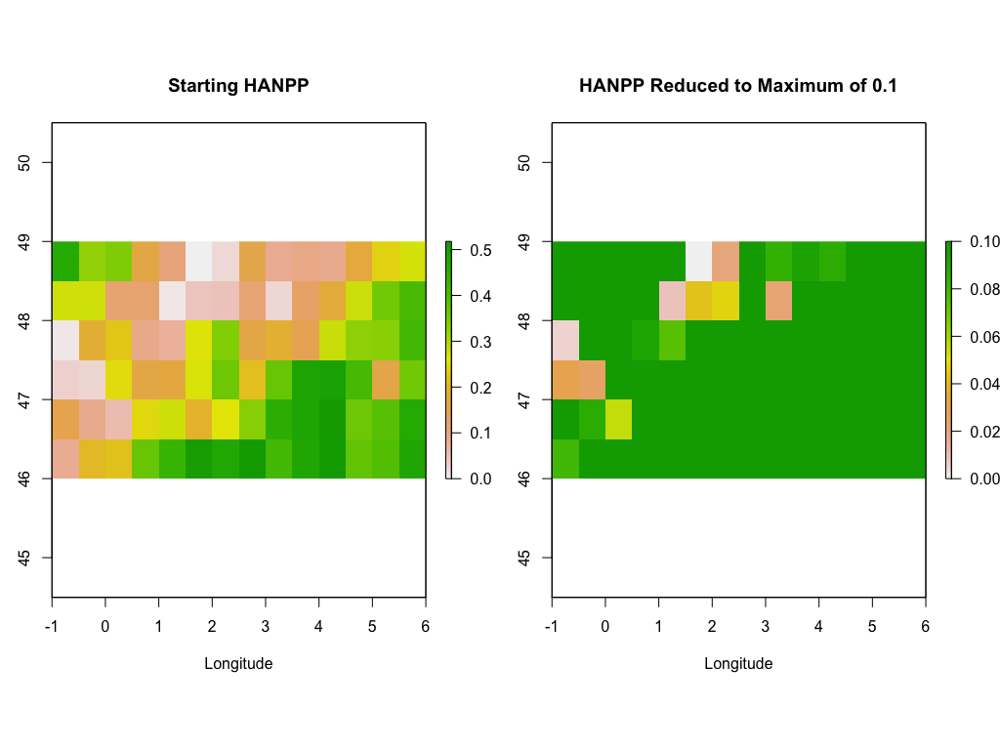
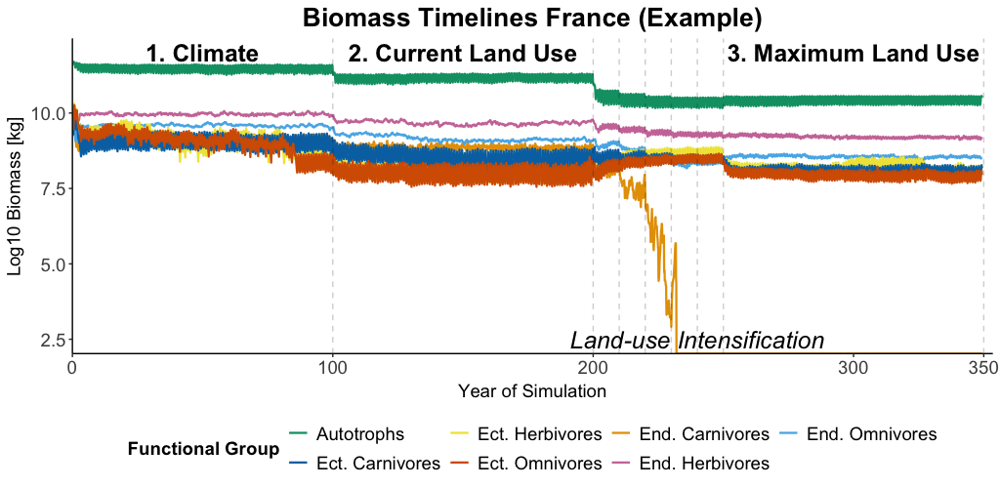

# Data Repository: Model-based Impact Analysis of Climate Change and Land-use Intensification on Trophic Networks

#### Author: Christian Neumann
#### Date: 28.10.2024
#### Repository for: Neumann, C., Sritongchuay, T. and Seppelt, R. 2024. Model-based impact analysis of climate change and land-use intensification on trophic networks. - Ecography 2024:e07533, doi: 10.1111/ecog.07533

## Overview

The repository includes six folders:

-  The input folder contains the already aggregated simulation output for each region and climate scenario needed to run the analysis scripts (the original files were too large to upload to a repository).
-  The pre-processing folder includes the script to calculate the 30-year averages of the climate data, and the script used to aggregate the simulation results across replicates can be found in the model run folder ("Aggregate_Output.R").
-  The analysis folder contains the scripts needed to run the analysis and plot the figures used in the manuscript and SI. 
-  The model run folder contains the scripts needed to run the original model simulations. In order to run this script, additional climate data must be provided by the user (as required by MadingleyR).
-  The output folder contains all output figures and output tables created in the repository.
-  The example folder contains the data needed to run our example below.

The climate data used in this study can be found here:

-   [Historical climate scenario](https://doi.org/http://doi.org/10.22033/ESGF/CMIP6.4067)
-   [SSP1-2.6 climate scenario](https://doi.org/http://doi.org/10.22033/ESGF/CMIP6.4067)
-   [SSP5-8.5 climate scenario](https://doi.org/http://doi.org/10.22033/ESGF/CMIP6.4067)

Before the data can be used, they need to be pre-processed to meet the requirements of the MadingleyR package, for example as described in the supplementary material of the study (also available in this repository).

All analysis scripts can be run using the aggregated simulation output in the input folder of the repository. The climate data we used for our simulations is too large to upload to a repository, so we have created an example here to allow you to follow our workflow. The original script can be found in the Model_Run folder and can be run with climate data that meets the requirements (not given here). 

**Note:** 

- The paths may need to be changed for some scripts (mainly the climate data pre-processing/model output scripts) according to your directory.
- The names of the simulation experiments partly differ from the names in the manuscript. For example, HANPP refers to the current land use and maxHANPP refers to the maximum land use simulation. 

To give an insight into our simulations, **we provide here an example of how the simulations in our study are performed** using the MadingleyR package. We use 0.5 degree data (to match the region sizes of our original model simulations) from the standard MadingleyR input datasets.

## Create the environment

First we have to create the environment that is necessary to perform the simulations. 

1.) We need to install "MadingleyR", following the [instructions](https://github.com/MadingleyR/MadingleyR/blob/master/README.md).

2.) We need to load MadingleyR for performing the simulations and some additional functions provided on Github for preparing data input.

``` r

library(MadingleyR)
library(terra)
library(tidyverse)

#Source: Hoeks, S. (2022): 
#Function to crop spatial raster input of MadingleyR using spatial window
source("https://raw.githubusercontent.com/SHoeks/RandomMadingleyRFunctions/master/crop_spatial_rasters_to_window.r")

# download and load 0.5 degree inputs 
source("https://raw.githubusercontent.com/SHoeks/MadingleyR_0.5degree_inputs/master/DownloadLoadHalfDegreeInputs.R")

#Insert climate data that matches MadingleyR requirements
source("InsertClimateDataFunction.R") 

#Create output path for simulation output
regionpath <- paste(getwd(), "png/Example_Output", sep = "/")

```

## Define study region

MadingleyR  uses as input the spatial extent defined as a vector (spatial_window): c(min. longitude, max. longitude, min. latitude, max. latitude) to define its simulation region. For this example we use France as our study region.

``` r

#define spatial extent of region, meeting requirements of MadingleyR (min. longitude, max. longitude, min. latitude, max. latitude)
#spatial_window <- c(25.5,28.5,61,69) #96 grid cells, Finland
#spatial_window <- c(16,21,-22,-17) #90 grid cells, Namibia 
#spatial_window <- c(-69,-61,-3,0) #96 grid cells, Brazil 
spatial_window <- c(-1,6,46,49) #84 grid cells, France

#define region
region <- "France"

#create output path for regional output 
regionpath <- paste0(getwd(), sep = "/", "example/", "output", sep="/")

#check if region extent is chosen correctly 
plot_spatialwindow(spatial_window)

```



## Create model inputs

Before we can initialize the model, we need to load the inputs required by the model. MadingleyR needs information on cohorts (chrt_def), stocks (stck_def), model parameters (mdl_prms) and the spatial climate data (sptl_inp).
This is where we load the spatial input required by the model. For this example, we use the standard MadingleyR spatial input at 0.5 degree resolution. In our simulations we have used data for three different climate scenarios, which have been pre-processed to meet the requirements of MadingleyR. These can be downloaded from the above sources. 

``` r

#create directory for climate data 
envDIR <- paste(getwd(), "example", "0.5_degree_data", sep = "/")

#Create spatial input 
#Download 0.5 degree Madingley compatible data & create spatial input for model (used in this example)
sptl_inp <- DownloadLoadHalfDegreeInputs(envDIR)

#Alternative 1: Load standard 1 degree spatial input of Madingley
#sptl_inp <- madingley_inputs("spatial inputs") 
#Alternative 2: Load any climate data input that is matching data requirements (Like the climate data in our study)
#sptl_inp <- insert_climate_data("path/to/climate/data") #here it is possible to insert any climate data matching the default madingleyR requirements in 0.5degree resolution

chrt_def <- madingley_inputs("cohort definition")
stck_def <- madingley_inputs("stock definition")
mdl_prms <- madingley_inputs("model parameters")

#crop the raster to spatial window extent (safe resources while running the model)
sptl_inp <- crop_spatial_rasters_to_window(inputs = sptl_inp, spatial_window = spatial_window)

#plot hanpp raster to see if cropping worked 
plot(sptl_inp$hanpp, main = "HANPP in Study Region", xlab = "Longitude", ylab = "Latitude")
text(x=5.9, y=48.5, "HANPP [gC/m-2/yr]", xpd=NA, pos=4)

```



## Run the model

Now we run the three simulation experiments. In our original simulations, we run each of the experiments for each region and for each climate scenario.  For the sake of simplicity, we only use an exemplary standard setup here. The following steps are carried out 
1) Initialise the model, 
2) Running the climate simulation experiment, 
3) The current land use experiment (hereafter referred to as HANPP), 
4) The vegetation reduction experiment,  
5) The maximum land use experiment after vegetation reduction (hereafter referred to as maxHANPP).

**Note:**

-   We have reduced the number of cohorts and years in this example to speed up the simulations. For our simulations, we run the model for 200 years in each simulation experiment, with a maximum cohort size of 1000.
-   To create replicates we additionally put the following code in a `for loop` & repeated our simulations 10 times.

### 1.) Initialize the model

``` r
###------------------###
### INITIALIZE MODEL ###
###------------------###

historical_2014 <- madingley_init(spatial_window = spatial_window, 
                                 cohort_def = chrt_def,
                                 stock_def = stck_def,
                                 spatial_inputs = sptl_inp, #run model with default climate data = sptl_input  
                                 max_cohort = 100)
                                 
```

### 2.) Run the climate simulation experiment / spin-up simulation

``` r

###create a list file, where all outputs will be stored
historical_2014_list <- list()

historical_2014_list[[1]] <- madingley_run(out_dir = regionpath, #path to output directory
                                          madingley_data = historical_2014,
                                          years = 100, # at least 200 years recommended
                                          cohort_def = chrt_def,
                                          stock_def = stck_def,
                                          spatial_inputs = sptl_inp,
                                          model_parameters = mdl_prms,
                                          max_cohort = 100) # at least 500 is recommended 
                                          
```

### 3.) Run the current land use simulation experiment, applying HANPP

``` r

#run model for additional 200 years with applying hanpp as input raster with gC/m-2/year
historical_2014_list[[2]] <- madingley_run(out_dir = regionpath, #path to output directory
                                          madingley_data = historical_2014_list[[1]],
                                          years = 100, # at least 200 years recommended
                                          cohort_def = chrt_def,
                                          stock_def = stck_def,
                                          spatial_inputs = sptl_inp,
                                          model_parameters = mdl_prms,
                                          max_cohort = 100, # at least 500 is recommended 
                                          apply_hanpp = 2)  #apply_hanpp = 2 is to apply hanpp with gC/m-2/year as input
                                          
```

### 4.) Reduce the vegetation, by maximizing HANPP

To reduce vegetation by maximizing HANPP, we first normalize the HANPP raster to a zero to one scale. Since fractional values in the MadingleyR model reduce NPP as a factor, a value of 0.9 represents a 0.1 reduction in autotroph productivity. We therefore invert the values of the HANPP raster. High HANPP values become low values (but with the highest HANPP) and low HANPP values become high values (but with the lowest HANPP). Assuming that the high values are grid cells with low HANPP and still vegetation, we reduce the vegetation by 0.1 to a minimum of 0.1 in each grid cell (90% HANPP intensity) while running the model for 10 years. 

Areas with values < 0.1 are grid cells where the HANPP intensity was already above the 90% threshold (> 0.9) before the HANPP grid was modified. 

``` r

###-------------------------------------------------------###
### Simulation Experiment 3: Maximum Land Use (maxHANPP)  ###
###-------------------------------------------------------###

#calculation of fractional hanpp raster
sptl_inp$hanpp[] <- sptl_inp$hanpp[] + abs(min(sptl_inp$hanpp[], na.rm = TRUE)) 
sptl_inp$hanpp[] <- sptl_inp$hanpp[] / max(sptl_inp$hanpp[], na.rm = TRUE)  
sptl_inp$hanpp[] <- 1-sptl_inp$hanpp[]  # The subtraction 1-HANPP leads to swapped values, this means the lower values are the values with the highest HANPP and the higher values are the values with lowest HANPP --> So, we can assume that a reduction in these values is a reduction in biomass, and not a reduction in HANPP.

#remove NA's
sptl_inp$hanpp[is.na(sptl_inp$hanpp[])] <- 0.001

###VEGETATION REDUCTION###
#Create HANPP backup to compare with reduced HANPP later
hanpp_backup <- sptl_inp$hanpp

#Reduce vegetation using a while loop, stops when needed (no more values above 0.1 in hanpp raster)
while(max(sptl_inp$hanpp[])>0.1) {
  
  #use ifelse to reduce vegetation by 0.1 per 5 years (if its > 0.1), but not below the threshold 0.1
  sptl_inp$hanpp[] <- ifelse(sptl_inp$hanpp[] > 0.1,
                                        ifelse(sptl_inp$hanpp[] - 0.1 < 0.1,0.1,sptl_inp$hanpp[] - 0.1),
                                        sptl_inp$hanpp[])
  plot(sptl_inp$hanpp)
  
  #run the model for 10 years with HANPP reduced by 0.1 (10 %)
  historical_2014_list[[length(historical_2014_list)+1]] <- madingley_run(out_dir = regionpath,
                                                                         years = 10, 
                                                                         madingley_data = historical_2014_list[[length(historical_2014_list)]],
                                                                         spatial_inputs = sptl_inp,
                                                                         silenced = TRUE,
                                                                         max_cohort = 100, # at least 500
                                                                         apply_hanpp = 1) #apply_hanpp = 1, reduces NPP in fractions provided in the hanpp spatial input raster, a fraction of 0.9 represent a 0.1 reduction in autotroph productivity.

}

par(mfrow=c(1,2))
plot(hanpp_backup,main="Starting HANPP", xlab = "Longitude", "Latitude")
plot(sptl_inp$hanpp,main="HANPP Reduced to Maximum of 0.1", xlab = "Longitude", ylab = "Latitude")
par(mfrow=c(1,1))

```



### 5.) Run the maximum land use experiment (Post-vegetation reduction phase)

After the vegetation reduction in the model, we run the model again for 100 years (200 in our original simulations) to allow the model to reach a stable state again. 

``` r

###POST VEGETATION REDUCTION###
historical_2014_list[[length(historical_2014_list)+1]] <- madingley_run(out_dir = regionpath,
                                                                        madingley_data = historical_2014_list[[length(historical_2014_list)]], 
                                                                        years = 100, #at least 200
                                                                        model_parameters = mdl_prms, 
                                                                        spatial_inputs = sptl_inp,
                                                                        cohort_def = chrt_def,
                                                                        max_cohort = 100, #at least 500
                                                                        apply_hanpp = 1)
                                                                        
```

### 6.) Plot biomass timelines

To visualize our example, we plot the biomass timelines for the autotroph and heterotroph functional groups. The decrease in biomass due to the reduction of vegetation in step 4) is clearly visible and marked with the label 'land use intensification'.

``` r

autotroph_biomass <- data.frame()  # Initialize an empty data frame

# Concatenate the data frames and keep track of the total years
for (i in 1:length(historical_2014_list)) {

  x <- historical_2014_list[[i]]$time_line_stocks
  
  autotroph_biomass <- rbind(autotroph_biomass, x)
  
}

autotroph_biomass$Month <- seq(1, 4192, 1)

FG_biomass <- data.frame()  # Initialize an empty data frame

# Concatenate the data frames and keep track of the total years
for (i in 1:length(historical_2014_list)) {

  x <- historical_2014_list[[i]]$time_line_cohorts
  
  FG_biomass <- rbind(FG_biomass, x)
  
}

FG_biomass$Month <- seq(1, 4192, 1)

#summarize ectotherms biomass: 
FG_biomass <- FG_biomass %>% rowwise() %>% 
  dplyr::mutate(Biomass_FG_3 = sum(c(Biomass_FG_3,Biomass_FG_6)),Biomass_FG_4 = sum(c(Biomass_FG_4,Biomass_FG_7)),Biomass_FG_5 = sum(c(Biomass_FG_5, Biomass_FG_8))) %>%
  summarize(Month,Year,Biomass_FG_0,Biomass_FG_1,Biomass_FG_2,Biomass_FG_3,Biomass_FG_4,Biomass_FG_5) %>%
  ungroup() %>%   as.data.frame()

#add autotroph biomass to heterotroph biomass for timelines plot
Biomass <- cbind(FG_biomass,autotroph_biomass$TotalStockBiomass)

ggplot(data=Biomass, aes(x=Month/12))+
  geom_line(aes(y=log10(autotroph_biomass$TotalStockBiomass),colour="Autotrophs"),linewidth=0.8)+
  geom_line(aes(y=log10(Biomass_FG_0),colour="End. Herbivores"),linewidth=0.8)+
  geom_line(aes(y=log10(Biomass_FG_1),colour="End. Carnivores"),linewidth=0.8)+
  geom_line(aes(y=log10(Biomass_FG_2),colour="End. Omnivores"),linewidth=0.8)+
  geom_line(aes(y=log10(Biomass_FG_3),colour="Ect. Herbivores"),linewidth=0.8)+
  geom_line(aes(y=log10(Biomass_FG_4),colour="Ect. Carnivores"),linewidth=0.8)+
  geom_line(aes(y=log10(Biomass_FG_5),colour="Ect. Omnivores"),linewidth=0.8)+
  scale_colour_manual(name = "Functional Group", values = c("Autotrophs"="#009E73",
                                                            "End. Herbivores" = "#CC79A7",
                                                            "End. Carnivores" = "#E69F00",
                                                            "End. Omnivores" = "#56B4E9",
                                                            "Ect. Herbivores" = "#F0E442",
                                                            "Ect. Carnivores" = "#0072B2",
                                                            "Ect. Omnivores" = "#D55E00"))+
  geom_vline(xintercept = c(100, 200, 210, 220, 230, 240, 250, 350),linetype="dashed",alpha =0.2)+
  scale_x_continuous(breaks=c(0,100,200,300,350),limits = c(0,350), expand = c(0,0,0.01,0))+
  labs(x='Year of Simulation', y = "Log10 Biomass [kg]", title = "Biomass Timelines France (Example)")+
  annotate("text", label=c("1. Climate","2. Current Land Use","Land-use Intensification", "3. Maximum Land Use"),
           x=c(50, 150, 240, 300),y=c(12, 12, 2.5, 12), size=6.5, fontface=c("bold","bold","italic","bold"))+
  theme_classic()+
  theme(plot.title = element_text(face = "bold", hjust =0.5, size = 20))+
  theme(axis.text.y = element_text(size = 14), 
        axis.title.y = element_text(margin = margin(t = 0, r = 5, b = 0, l = 0),size=14)) +
  theme(axis.text.x = element_text(size = 14),
        axis.title.x = element_text(margin = margin(t = 5, r = 0, b = 0, l = 0),size=14))+
  theme(legend.text = element_text(size=14),legend.title = element_text(size=14,face="bold")) +
  theme(legend.position = "bottom") 

```



# References

Voldoire, A. 2019a. CNRM-CERFACS CNRM-CM6-1-HR model output prepared for CMIP6 CMIP historical (No. 20191021). doi: <https://doi.org/http://doi.org/10.22033/ESGF/CMIP6.4067>.

Voldoire, A. 2019b. CNRM-CERFACS CNRM-CM6-1-HR model output prepared for CMIP6 ScenarioMIP ssp126 (No. 20200127). doi: <https://doi.org/http://doi.org/10.22033/ESGF/CMIP6.4067>.

Voldoire, A. 2019c. CNRM-CERFACS CNRM-CM6-1-HR model output prepared for CMIP6 ScenarioMIP ssp585 (No. 20191202). doi: <https://doi.org/http://doi.org/10.22033/ESGF/CMIP6.4067>.
